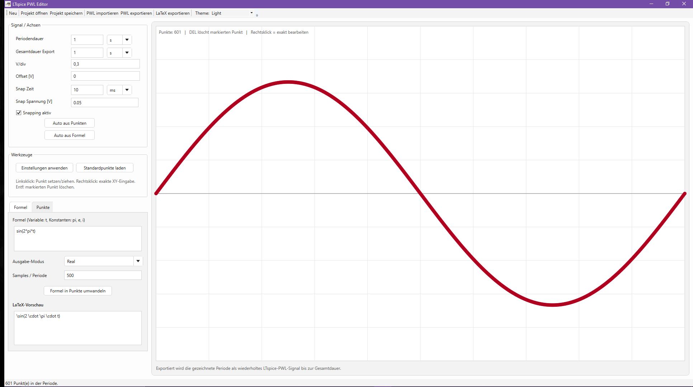

> **Hinweis:** Diese README wurde mit Unterstützung von KI erstellt und anschließend für das Projekt angepasst.

# LTspice PWL Editor

Ein kompakter Editor zum Erstellen, Bearbeiten und Exportieren periodischer PWL-Signale für LTspice.  
Die Anwendung bietet eine grafische Punktbearbeitung, Formel-zu-Kurve-Umwandlung, automatische Achsenskalierung sowie Exportfunktionen für PWL- und LaTeX-Daten in einer modernen hellen oder dunklen Oberfläche.

## GUI-Übersicht



Die Oberfläche ist in zwei Hauptbereiche aufgeteilt:

- **Linke Seite:** Einstellungen, Werkzeuge, Formel-Eingabe und Punktliste
- **Rechte Seite:** grafischer Editor für die Kurve
- **Unten:** Statusleiste mit Hinweisen und Rückmeldungen

---

## Hauptfunktionen

- Grafisches Erstellen und Bearbeiten einer periodischen Kurve
- Import und Export von **LTspice-PWL-Dateien**
- Erzeugen von Kurven aus mathematischen **Formeln**
- Automatische Bestimmung von **Periodendauer** und **Y-Achse**
- Umschaltbares **Light-/Dark-Theme**
- Unterstützung für **komplexe Formeln** mit verschiedenen Ausgabemodi

---

## Bedienung

### 1. Signal / Achsen

Im Bereich **„Signal / Achsen“** werden die grundlegenden Parameter für die Darstellung und den Export festgelegt.

#### Periodendauer
Legt fest, wie lang **eine Periode** des Signals ist.  
Die Einheit kann zwischen `s`, `ms`, `us` und `ns` gewählt werden.

#### Gesamtdauer Export
Legt fest, wie lange das Signal beim Export insgesamt wiederholt wird.

#### V/div
Bestimmt die vertikale Skalierung des Editors in **Volt pro Division**.

#### Offset [V]
Verschiebt die Y-Achse vertikal.  
Damit kann das Signal z. B. um einen Gleichanteil verschoben dargestellt werden.

#### Snap Zeit
Bestimmt das Raster für das Einrasten in X-Richtung.

#### Snap Spannung [V]
Bestimmt das Raster für das Einrasten in Y-Richtung.

#### Snapping aktiv
Wenn aktiviert, rasten Punkte beim Verschieben auf das eingestellte Raster ein.

#### Auto aus Punkten
Bestimmt passende Achsen- und Zeitwerte automatisch anhand der aktuell vorhandenen Punkte.

#### Auto aus Formel
Analysiert die eingegebene Formel automatisch und versucht:

- die **Periodendauer**
- die **Y-Achsen-Skalierung**
- sowie eine passende **Kurvenform**

automatisch festzulegen.

---

### 2. Werkzeuge

#### Einstellungen anwenden
Übernimmt alle aktuell eingetragenen Werte in den grafischen Editor.

#### Standardpunkte laden
Lädt eine Beispielkurve mit Standardpunkten.

---

### 3. Formel

Im Tab **„Formel“** kann statt manueller Punktbearbeitung eine mathematische Funktion verwendet werden.

#### Formel eingeben
Die Formel wird mit der Variablen `t` angegeben.

Beispiele:

```text
sin(2*pi*t)
cos(2*pi*t)
sin(2*pi*t)*0.5
exp(i*2*pi*t)
cos(2*pi*t)+i*sin(2*pi*t)
```

#### Verfügbare Konstanten

- `pi`
- `e`
- `i`

#### Ausgabe-Modus
Bestimmt, welcher Teil eines komplexen Ergebnisses als Kurve dargestellt wird:

- **Real** → Realteil
- **Imaginary** → Imaginärteil
- **Magnitude** → Betrag
- **Phase** → Phasenwinkel

#### Samples / Periode
Legt fest, wie viele Stützpunkte pro Periode aus der Formel erzeugt werden.

#### Formel in Punkte umwandeln
Erzeugt aus der Formel eine Punktliste und lädt diese direkt in den Editor.

#### LaTeX-Vorschau
Zeigt eine einfache LaTeX-Darstellung der eingegebenen Formel.

---

### 4. Punkte

Im Tab **„Punkte“** wird die aktuelle Punktliste angezeigt.

Jeder Punkt besteht aus:

- **X** = Zeitposition
- **Y** = Spannungswert

Die Tabelle dient zur Kontrolle der erzeugten oder gezeichneten Punkte.

---

### 5. Grafischer Editor

Der große Bereich auf der rechten Seite ist der eigentliche Kurveneditor.

#### Maussteuerung

- **Linksklick auf freie Stelle**  
  Fügt einen neuen Punkt ein

- **Linksklick auf vorhandenen Punkt und ziehen**  
  Verschiebt den Punkt

- **Rechtsklick auf einen Punkt**  
  Öffnet den Dialog zur exakten Eingabe von X- und Y-Wert

- **Entf / Delete**  
  Löscht den aktuell markierten Punkt

#### Punktbearbeitung per Dialog
Im Dialog **„Punkt bearbeiten“** können X- und Y-Werte exakt eingegeben werden.  
Dabei werden die zulässigen Wertebereiche für Zeit und Spannung angezeigt.

---

### 6. Mausrad-Unterstützung

Mehrere Eingabefelder lassen sich bequem mit dem **Mausrad** ändern.

Unterstützt werden unter anderem:

- `V/div`
- `YOffset`
- `Snap Spannung`
- `Periodendauer`
- `Snap Zeit`

#### Verhalten bei Zeitfeldern
Bei `Periodendauer` und `Snap Zeit` wird beim Scrollen automatisch auch die **Einheit** angepasst.

Beispiel:

```text
800 ms → 900 ms → 1 s → 2 s
```

#### Verhalten bei V/div
`V/div` verwendet sinnvolle Spannungsstufen, z. B.:

```text
0.1 → 0.2 → ... → 1 → 2 → 3 → 4 → 5 → 10 → 20 → 30 ...
```

---

### 7. Import und Export

#### Projekt speichern
Speichert alle aktuellen Einstellungen und Punkte als Projektdatei.

#### Projekt öffnen
Lädt eine zuvor gespeicherte Projektdatei.

#### PWL importieren
Importiert eine vorhandene PWL-, TXT- oder CSV-Datei und übernimmt die darin enthaltenen Punkte.

#### PWL exportieren
Exportiert die aktuell gezeichnete Periode als **wiederholtes LTspice-PWL-Signal** bis zur eingestellten Gesamtdauer.

#### LaTeX exportieren
Speichert die aktuelle LaTeX-Vorschau als `.tex`- oder `.txt`-Datei.

---

## Typischer Arbeitsablauf

### Manuelles Erstellen einer Kurve

1. Periodendauer und Achsen einstellen
2. Punkte im grafischen Editor setzen
3. Punkte bei Bedarf verschieben oder exakt bearbeiten
4. Gesamtdauer für den Export festlegen
5. PWL exportieren

### Erzeugen aus einer Formel

1. Formel eingeben
2. Ausgabe-Modus wählen
3. Samples pro Periode festlegen
4. **„Formel in Punkte umwandeln“** klicken
5. Bei Bedarf **„Auto aus Formel“** verwenden
6. PWL exportieren

### Import einer vorhandenen Datei

1. **„PWL importieren“** wählen
2. Datei laden
3. Darstellung prüfen
4. Achsen bei Bedarf automatisch anpassen
5. Datei weiter bearbeiten oder erneut exportieren

---

## Hinweise

- Die gezeichnete Kurve stellt **eine Periode** dar.
- Beim Export wird diese Periode bis zur eingestellten **Gesamtdauer** wiederholt.
- Für präzise Bearbeitung einzelner Punkte empfiehlt sich der **Rechtsklick-Dialog**.
- Bei aktivem Snapping rasten Punkte auf das eingestellte Zeit- und Spannungsraster ein.
- Komplexe Formeln sind vor allem in Verbindung mit den Modi **Real**, **Imaginary**, **Magnitude** und **Phase** interessant.

---

## Beispielformeln

### Sinus

```text
sin(2*pi*t)
```

### Kosinus

```text
cos(2*pi*t)
```

### Gedämpfte Schwingung

```text
exp(-3*t)*sin(2*pi*t)
```

### Komplexer Zeiger

```text
exp(i*2*pi*t)
```

### Real- und Imaginärteil getrennt testen

```text
cos(2*pi*t)+i*sin(2*pi*t)
```

---

## Theme

Die Anwendung unterstützt:

- **Light Mode**
- **Dark Mode**

Das Theme kann oben in der Toolbar umgeschaltet werden.
